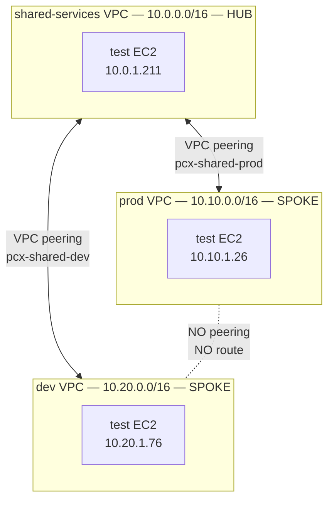

# Architecture

## Hub-and-spoke topology



## Routing model

Each VPC's route table contains:

| VPC | Routes to peer CIDRs |
|---|---|
| `shared-services` (hub) | `10.10.0.0/16 -> pcx-shared-prod`, `10.20.0.0/16 -> pcx-shared-dev` |
| `prod` (spoke) | `10.0.0.0/16 -> pcx-shared-prod` only — no route to dev |
| `dev` (spoke) | `10.0.0.0/16 -> pcx-shared-dev` only — no route to prod |

The hub knows how to reach both spokes. Each spoke only knows the hub. **The absence of a peering connection between spokes is the security control** — packets between prod and dev get dropped at the source VPC's route table.

## Why VPC peering and not Transit Gateway?

| Aspect | VPC peering (this lab) | Transit Gateway |
|---|---|---|
| Connection model | Per-pair, mesh up to ~125 connections per VPC | Hub: all VPCs attach to TGW |
| Routing | Per-route-table entries | TGW route tables (more flexible) |
| Centralized inspection | Not supported | Attach Network Firewall or appliance |
| Cost | Free connection; data transfer charges only | $0.05/hr per attachment + data |
| When to use | < ~10 VPCs, no centralized inspection needed | At scale, or when a firewall must be in path |

For 3 VPCs, peering is the simpler and cheaper option. The lab demonstrates the same security model that Transit Gateway would enforce via route tables.

## The "failed ping IS the success screenshot"

The signature artifact of this lab is the verification ping test, captured live across SSH:

```
prod -> shared : 0% loss, 0.563ms avg    OK   via shared<->prod peering
dev  -> shared : 0% loss, 0.583ms avg    OK   via shared<->dev peering
prod -> dev    : 100% packet loss        FAIL no peering, no route
dev  -> prod   : 100% packet loss        FAIL no peering, no route
```

The two failed pings prove the model is enforced at the network layer, not by security group rules or by trust. Even if a misconfigured SG allowed traffic, there's no route for it.

## Connection to enterprise patterns

This is the foundation of AWS [Centralized Network Inspection](https://aws.amazon.com/blogs/networking-and-content-delivery/centralized-inspection-architecture-with-aws-gateway-load-balancer/) and the topology behind AWS Control Tower's network account. In production, the hub becomes a Transit Gateway and the spokes become workload VPCs. The security model — workload isolation enforced by routing — is identical.
